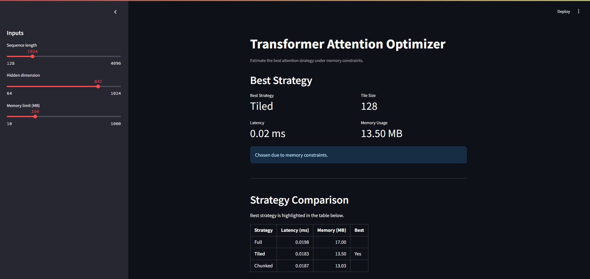
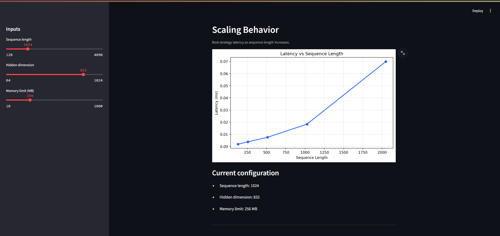
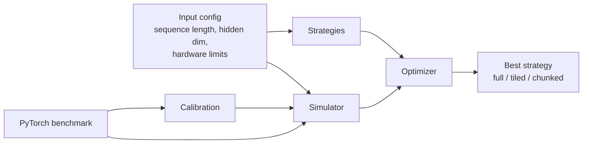

# Attention Execution Optimizer


## Dashboard Preview

The Streamlit dashboard provides a quick way to explore the optimizer interactively.





The first view shows the selected strategy and strategy comparison table.
The second view shows how the best-strategy latency scales with sequence length.

This project is a lightweight systems model for choosing how transformer attention should execute under memory constraints.

Instead of trying to be a full compiler or a real kernel stack, it focuses on one practical question:

> Given a sequence length, hidden dimension, and hardware limits, which attention strategy is the best choice?

The answer is produced by a calibrated simulator plus a simple optimizer that evaluates a small set of candidate strategies.

## Why this project exists

Transformer attention is one of the most important and expensive parts of modern LLM inference.

In practice, attention is often limited by:
- memory bandwidth
- KV-cache traffic
- activation working set size
- how efficiently data can be reused

The goal of this project is to model those constraints in a way that is:
- simple enough to understand
- realistic enough to be useful
- stable enough to compare strategies

## What the system does

The system:
1. Simulates attention execution
2. Estimates latency and memory usage
3. Compares multiple execution strategies
4. Rejects strategies that exceed memory limits
5. Selects the lowest-latency feasible option

## Strategies modeled

### Full attention

The baseline strategy.

It represents the most direct form of attention execution and is the easiest to reason about, but it is also the most memory-heavy in the model.

### Tiled attention

This strategy breaks the sequence into tiles.

It reduces the working set and improves memory behavior, but it introduces some overhead from block management.

### Chunked attention

This strategy is modeled as the most memory-efficient option in the project.

It reflects the intuition behind streaming or FlashAttention-like execution, where the system avoids materializing the full attention matrix and keeps only a small working buffer active.

## How the model works

The simulator is built around a few core systems ideas:

### Compute modeling

The simulator estimates the main attention operations:
- `QK^T`
- softmax
- `AV`

This gives a rough FLOP estimate for each configuration.

### Memory modeling

The simulator estimates memory from:
- `Q`, `K`, `V`
- output storage
- a working buffer

The model intentionally avoids naive full `n x n` memory growth, because practical implementations reuse data and stream blocks rather than materializing everything at once.

### Roofline-style bottleneck

The simulator uses a roofline-inspired idea:
- estimate compute time
- estimate memory time
- use the dominant bottleneck

That matches real systems better than simply adding the two together.

### Calibration

To keep the model aligned with empirical results, the simulator also includes:
- parallelism
- efficiency scaling with sequence length
- compute-vs-memory dominance correction
- a global latency calibration factor

These are calibration tools, not attempts at perfect hardware emulation.

## Architecture



The system is intentionally small:
- the simulator estimates cost
- the strategies define candidate execution plans
- the optimizer searches over those plans
- the benchmark script validates the calibration against real PyTorch execution

## Repository layout

- `src/attention_optimizer/simulator.py` - core performance model
- `src/attention_optimizer/strategies.py` - execution strategy estimates
- `src/attention_optimizer/optimizer.py` - grid-search selection logic
- `main.py` - runs the optimizer on one example configuration
- `app.py` - Streamlit dashboard for interactive exploration
- `validate_strategies.py` - sanity checks for strategy ranking
- `benchmark_attention.py` - compares simulator latency with PyTorch
- `plot_attention_latency.py` - plots simulator vs actual latency
- `docs/` - documentation, concepts, and design notes

## How to run

### Optimizer demo

```powershell
python main.py
```

### Validate strategy ranking

```powershell
python validate_strategies.py
```

### Run the benchmark

```powershell
python benchmark_attention.py
```

### Plot latency

```powershell
python plot_attention_latency.py
```

### Launch the dashboard

```powershell
streamlit run app.py
```

## What to expect

The project is designed to get the following right:
- strategy ranking
- memory feasibility
- latency trend with sequence length
- rough agreement with benchmark measurements

It is not designed to produce cycle-accurate predictions.

## Example benchmark behavior

On the current calibration, the benchmark shows the simulator staying in the same general range as real PyTorch execution:

- `n=128` -> simulator and actual are both small
- `n=512` -> simulator and actual remain in the same order of magnitude
- `n=1024` -> simulator and actual still track the same trend

That is enough for decision-making and strategy comparison.

## Results

The current system produces:

- calibrated latency estimates in milliseconds
- memory-aware strategy selection
- consistent ranking across full, tiled, and chunked attention
- benchmark alignment that is good enough for modeling and decision-making

In practice, the model is useful because it gets the relative behavior right:
- memory-heavy strategies are penalized
- tiled and chunked execution reduce working-set pressure
- the optimizer can choose a feasible low-latency plan under memory constraints

### Benchmark snapshot

| Sequence | Simulator | Actual |
| --- | --- | --- |
| 128 | 0.80 ms | 2.60 ms |
| 512 | 2.43 ms | 1.96 ms |
| 1024 | 4.62 ms | 5.23 ms |

The exact values vary by machine, but the important part is that the simulator stays in the right range and preserves the same trend.

## Key insight

Modern attention is usually limited more by memory movement than by raw arithmetic.

That is why this project models:
- memory reuse
- working-set size
- bottleneck dominance
- calibration against measured execution

This is the core systems insight behind the project.

## What I learned

This project shows the gap between theory and implementation.

It demonstrates:
- why naive `n^2` thinking is not enough for real systems
- how roofline modeling helps reason about bottlenecks
- why calibration matters more than perfect prediction
- how to build a decision model that is useful even when approximate

## Documentation

If you want the deeper explanation, start here:

1. [Project overview](docs/project-overview.md)
2. [Architecture diagram](docs/architecture-diagram.md)
3. [Attention concepts](docs/attention-concepts.md)
4. [Modeling guide](docs/modeling-guide.md)
5. [Field guide](docs/field-guide.md)
6. [Calibration notes](docs/calibration-notes.md)
7. [Limitations and future work](docs/limitations-and-future-work.md)
8. [Dashboard guide](docs/dashboard-guide.md)
9. [Usage guide](docs/usage-guide.md)

## Limitations

This project is intentionally simplified.

It does not model:
- GPU kernel internals
- cache hierarchy in detail
- exact allocator behavior
- tensor core scheduling
- full transformer blocks

The documentation in [limitations and future work](docs/limitations-and-future-work.md) explains what could be added later.


