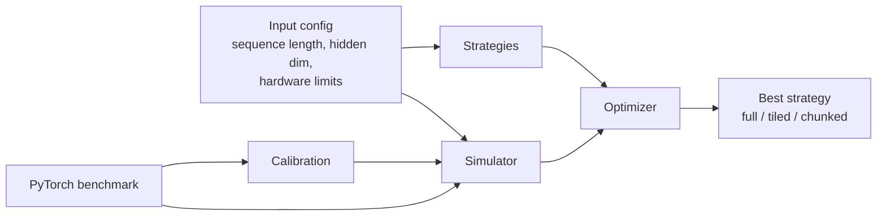

# Architecture Diagram

## How the pieces fit together

- The simulator estimates compute, memory, and latency.
- The strategies module defines the candidate execution plans.
- The optimizer evaluates those candidates and chooses the best feasible one.
- The benchmark script compares the simulator against real PyTorch execution.
- Calibration keeps the model aligned with real measurements without overfitting individual components.

